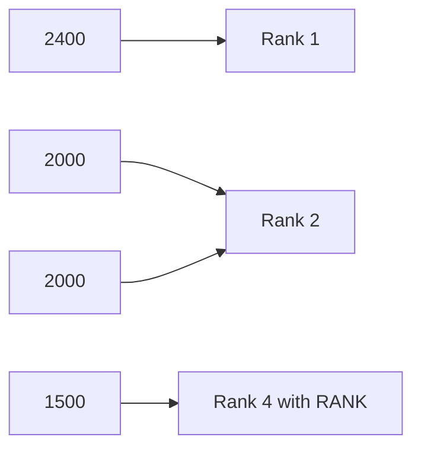
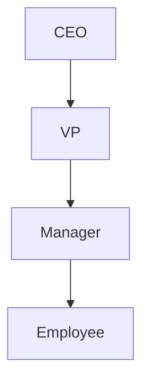
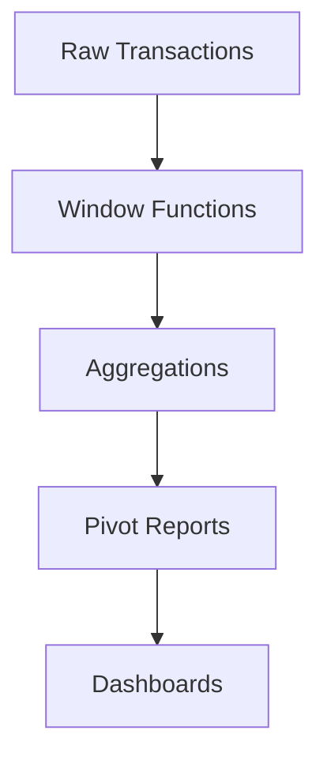

# 🚀 Advanced SQL Features — Complete Revision Notes

> **Oracle Advanced SQL | Window Functions · Hierarchical Queries · MERGE · PIVOT · Analytics**

---

# 📌 Module Overview

| Topic                | Main Purpose                                 |
| -------------------- | -------------------------------------------- |
| Window Functions     | Analyze related rows without collapsing data |
| Hierarchical Queries | Work with tree structures                    |
| Advanced Subqueries  | Complex filtering and calculations           |
| MERGE & Advanced DML | Efficient synchronization                    |
| PIVOT / UNPIVOT      | Matrix reporting                             |
| ROLLUP / CUBE        | Multi-dimensional summaries                  |

---

# 🧠 Most Important Concept

## 🔥 Aggregate vs Window Functions

| GROUP BY          | WINDOW FUNCTION                  |
| ----------------- | -------------------------------- |
| Collapses rows    | Keeps all rows                   |
| One row per group | Adds calculations beside rows    |
| Simple totals     | Rankings, running totals, trends |

---

# 📊 WINDOW FUNCTIONS

---

# 🧠 Basic Syntax

```sql
FUNCTION() OVER (
    PARTITION BY column
    ORDER BY column
)
```

---

# ⚡ OVER() is the key

Without:

```sql
SUM(amount)
```

→ Aggregates rows.

With:

```sql
SUM(amount) OVER()
```

→ Keeps rows and adds calculations.

---

# 🧠 PARTITION BY

Creates separate windows/groups.

```sql
PARTITION BY region
```

Means:

```text
Calculate separately for each region.
```

---

# 🧠 ORDER BY inside OVER

Defines sequence for:

* rankings
* running totals
* lag/lead
* moving averages

---

# 🏆 RANKING FUNCTIONS

---

# 📌 ROW_NUMBER()

Always unique numbers.

```sql
ROW_NUMBER() OVER (
    ORDER BY amount DESC
)
```

---

# 📌 RANK()

Same values share same rank.

BUT gaps exist.

Example:

```text
1
2
2
4
```

---

# 📌 DENSE_RANK()

No gaps.

```text
1
2
2
3
```

---

# ⚡ Difference Visualization



---

# 🚨 Interview Favorite

| Function   | Tie Handling      |
| ---------- | ----------------- |
| ROW_NUMBER | No ties           |
| RANK       | Ties + gaps       |
| DENSE_RANK | Ties without gaps |

---

# 📊 RUNNING TOTALS

---

# 📌 Example

```sql
SUM(amount) OVER (
    ORDER BY sale_date
)
```

---

# 🧠 What Happens

Each row accumulates previous rows.

```text
100
300
450
700
```

---

# 📌 Explicit Frame

```sql
ROWS BETWEEN UNBOUNDED PRECEDING
AND CURRENT ROW
```

---

# 🚨 Hidden Important Concept

Default window frame behavior can surprise you.

Especially with:

* LAST_VALUE
* RANGE
* duplicates

---

# ⏮️ LAG and LEAD

---

# 📌 LAG()

Access previous row.

```sql
LAG(amount)
OVER (ORDER BY sale_date)
```

---

# 📌 LEAD()

Access next row.

---

# 🧠 Real Use Cases

| Use Case            | Example                  |
| ------------------- | ------------------------ |
| Growth calculation  | Compare previous month   |
| Trend analysis      | Detect increase/decrease |
| Financial reporting | Previous balance         |

---

# 📌 MoM Growth Formula

```sql
(current - previous) / previous * 100
```

---

# 🚨 Important NULL Protection

```sql
NULLIF(previous, 0)
```

Prevents:

```text
division by zero
```

---

# 🎯 FIRST_VALUE / LAST_VALUE

---

# 📌 FIRST_VALUE()

Gets first row value in window.

---

# 📌 LAST_VALUE()

Gets last row value.

BUT ⚠️:

Requires explicit frame.

---

# 🚨 Most Common Mistake

```sql
LAST_VALUE()
```

without:

```sql
ROWS BETWEEN UNBOUNDED PRECEDING
AND UNBOUNDED FOLLOWING
```

gives unexpected results.

---

# 🧠 WINDOW FRAMES

---

# 📌 ROWS

Physical row count.

```sql
ROWS BETWEEN 2 PRECEDING
AND CURRENT ROW
```

---

# 📌 RANGE

Logical value range.

---

# ⚡ Difference

| ROWS       | RANGE       |
| ---------- | ----------- |
| Exact rows | Value-based |
| Physical   | Logical     |

---

# 📊 MOVING AVERAGES

---

# 📌 3-Day Moving Average

```sql
AVG(amount) OVER (
    ORDER BY sale_date
    ROWS BETWEEN 2 PRECEDING
    AND CURRENT ROW
)
```

---

# 🧠 Why Important

Used heavily in:

* finance
* forecasting
* analytics
* stock markets

---

# 🌳 HIERARCHICAL QUERIES

---

# 🧠 Tree Structures

Examples:

* org charts
* file systems
* product categories
* bill of materials

---

# 📌 CONNECT BY

Oracle’s hierarchy syntax.

---

# 📌 Basic Syntax

```sql
START WITH manager_id IS NULL
CONNECT BY PRIOR employee_id = manager_id
```

---

# 🧠 PRIOR

Represents parent row.

---

# 📌 LEVEL

Pseudo-column showing depth.

```text
1 = root
2 = child
3 = grandchild
```

---

# 🌲 Hierarchy Flow



---

# 📌 SYS_CONNECT_BY_PATH

Creates path strings.

```text
CEO → VP → Manager
```

---

# 📌 CONNECT_BY_ROOT

Gets top/root value.

---

# 📌 CONNECT_BY_ISLEAF

Checks if node has children.

---

# 📌 Bottom-Up Hierarchy

Reverse PRIOR direction.

```sql
CONNECT BY employee_id = PRIOR manager_id
```

---

# 🚨 Important Enterprise Use Cases

| Use Case            | Example       |
| ------------------- | ------------- |
| Organization charts | HR systems    |
| BOM explosion       | Manufacturing |
| Folder systems      | File storage  |
| Categories          | E-commerce    |

---

# 🔄 RECURSIVE CTE

Modern alternative to CONNECT BY.

---

# 📌 Structure

```sql
WITH cte AS (
    anchor_query
    UNION ALL
    recursive_query
)
```

---

# 🧠 Advantages

| Recursive CTE | CONNECT BY            |
| ------------- | --------------------- |
| Portable      | Oracle-specific       |
| Standard SQL  | Legacy Oracle syntax  |
| Flexible      | Simpler hierarchy use |

---

# 🧠 ADVANCED SUBQUERIES

---

# 📌 Correlated Subquery

Runs once per outer row.

```sql
WHERE salary > (
    SELECT AVG(salary)
    FROM employees
    WHERE dept = e.dept
)
```

---

# 🚨 Performance Warning

Correlated subqueries can become slow:

```text
N outer rows × subquery execution
```

---

# ✅ Often Better Alternative

Use:

* JOIN
* CTE
* window functions

---

# 📌 Scalar Subquery

Returns single value.

Can appear in:

* SELECT
* WHERE
* HAVING

---

# 📌 Inline View

Subquery inside FROM.

Acts like temporary table.

---

# ⚡ EXISTS vs IN

---

# 📌 EXISTS

Stops after first match.

Better for:

```text
large subquery results
```

---

# 📌 IN

Good for:

```text
small value lists
```

---

# 🚨 CRITICAL INTERVIEW POINT

## NOT IN + NULL = Dangerous

---

# ❌ Problem

```sql
WHERE id NOT IN (
    SELECT customer_id FROM orders
)
```

If subquery contains NULL:

```text
returns NO ROWS
```

---

# ✅ Safe Alternative

```sql
NOT EXISTS
```

---

# 📌 Multi-Column Subquery

```sql
WHERE (department, salary) IN (...)
```

Useful for:

* max-per-group
* composite comparisons

---

# 🧠 COMMON TABLE EXPRESSIONS (CTE)

---

# 📌 Purpose

Make queries:

* readable
* modular
* reusable

---

# 📌 Syntax

```sql
WITH cte_name AS (
    query
)
SELECT * FROM cte_name;
```

---

# 🧠 Enterprise Reality

Large BI queries may contain:

* 10+
* 20+
* even 50+ CTEs

---

# 🔄 MERGE (UPSERT)

---

# 🧠 MERGE combines:

| Operation | Purpose       |
| --------- | ------------- |
| UPDATE    | Existing rows |
| INSERT    | New rows      |

---

# 📌 Syntax

```sql
MERGE INTO target t
USING source s
ON (condition)
```

---

# 📌 MATCHED

```sql
WHEN MATCHED THEN UPDATE
```

---

# 📌 NOT MATCHED

```sql
WHEN NOT MATCHED THEN INSERT
```

---

# 🚨 Massive Enterprise Use

Used heavily in:

* ETL
* Data Warehousing
* CDC
* Synchronization

---

# ⚠️ Important MERGE Risk

Bad ON conditions can:

* duplicate rows
* corrupt data
* update unintended rows

---

# 📊 MULTI-TABLE INSERT

---

# 📌 INSERT ALL

One row → multiple tables.

---

# 📌 INSERT FIRST

First matching condition wins.

---

# ⚡ Difference

| INSERT ALL       | INSERT FIRST    |
| ---------------- | --------------- |
| Multiple targets | One target      |
| All conditions   | First condition |

---

# 📌 Enterprise Use Cases

| Use Case     | Example               |
| ------------ | --------------------- |
| ETL          | Split datasets        |
| Auditing     | Duplicate logs        |
| Data routing | Regional partitioning |

---

# 🔁 RETURNING Clause

---

# 📌 Purpose

Get values directly from DML.

---

# 📌 Example

```sql
INSERT ...
RETURNING id INTO variable;
```

---

# 🧠 Useful For

* generated IDs
* logging
* PL/SQL automation

---

# 🔄 PIVOT

---

# 🧠 Converts:

```text
Rows → Columns
```

---

# 📌 Example

| Region | Jan | Feb |
| ------ | --- | --- |
| North  | 100 | 200 |

---

# 📌 Syntax

```sql
PIVOT (
    SUM(amount)
    FOR month IN (...)
)
```

---

# 🚨 Important Limitation

Pivot values usually must be predefined.

Dynamic pivoting requires dynamic SQL.

---

# 🔄 UNPIVOT

---

# 🧠 Converts:

```text
Columns → Rows
```

---

# 📌 Example

| Q1      | Q2    |
| ------- | ----- |
| ↓       |       |
| Quarter | Sales |
| ---     | ---   |

---

# 📊 ROLLUP

---

# 🧠 Creates hierarchical subtotals.

---

# 📌 Example

```sql
GROUP BY ROLLUP(region, salesperson)
```

---

# Produces

```text
Detail rows
Region subtotal
Grand total
```

---

# 📊 CUBE

---

# 🧠 Generates ALL combinations.

---

# Example

```sql
CUBE(region, product)
```

Produces:

* region totals
* product totals
* combined totals
* grand total

---

# 🚨 CUBE Explosion Problem

Too many dimensions:

```text
2^n combinations
```

Can become huge.

---

# 📊 GROUPING SETS

---

# 🧠 Custom subtotal combinations.

More controlled than CUBE.

---

# 📌 Example

```sql
GROUP BY GROUPING SETS (
    (region),
    (product),
    ()
)
```

---

# 📌 GROUPING_ID()

Identifies subtotal/grand total rows.

---

# ⚡ Common BI Usage

Distinguish:

* detail rows
* subtotals
* grand totals

---

# 🧠 MODEL Clause

---

# 📌 Purpose

Spreadsheet-like calculations in SQL.

---

# ⚠️ Reality

Rarely used in industry because:

* hard to maintain
* difficult debugging
* complex syntax

But important academically.

---

# 🚀 Enterprise Analytics Architecture



---

# 🔥 Most Important Interview Topics

| Topic              | Importance |
| ------------------ | ---------- |
| ROW_NUMBER vs RANK | ⭐⭐⭐⭐⭐      |
| LAG / LEAD         | ⭐⭐⭐⭐⭐      |
| Running Totals     | ⭐⭐⭐⭐⭐      |
| CTE                | ⭐⭐⭐⭐⭐      |
| MERGE              | ⭐⭐⭐⭐⭐      |
| EXISTS vs IN       | ⭐⭐⭐⭐⭐      |
| CONNECT BY         | ⭐⭐⭐⭐       |
| PIVOT              | ⭐⭐⭐⭐       |
| ROLLUP / CUBE      | ⭐⭐⭐⭐       |

---

# 🚨 Most Common Real-World SQL Problems

| Problem            | Solution   |
| ------------------ | ---------- |
| Top-N per group    | ROW_NUMBER |
| Trend analysis     | LAG        |
| Running balances   | SUM OVER   |
| Hierarchies        | CONNECT BY |
| Upsert             | MERGE      |
| Matrix reports     | PIVOT      |
| Complex BI queries | CTE        |

---

# 🏁 Final Takeaways

✅ Window functions preserve rows while adding analytics
✅ PARTITION BY creates independent calculation groups
✅ LAG/LEAD are essential for trend analysis
✅ CONNECT BY handles hierarchical data elegantly in Oracle
✅ Recursive CTEs are the portable modern alternative
✅ MERGE is critical for ETL and synchronization
✅ PIVOT transforms rows into matrix reports
✅ ROLLUP/CUBE create multidimensional summaries
✅ NOT EXISTS is safer than NOT IN with NULLs
✅ Advanced SQL is the foundation of BI and analytics systems

