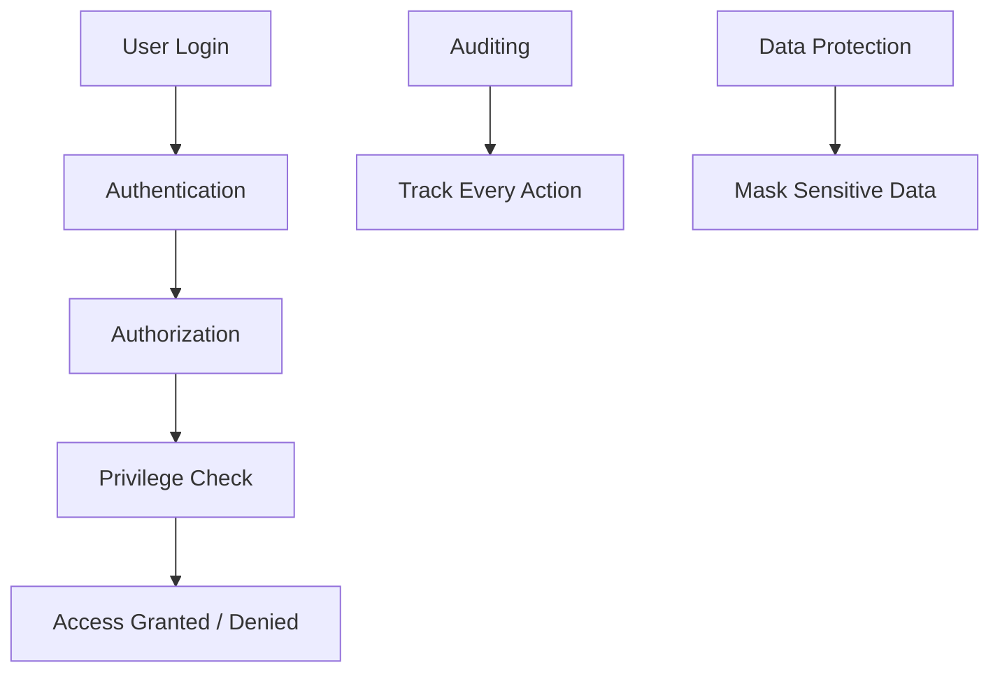
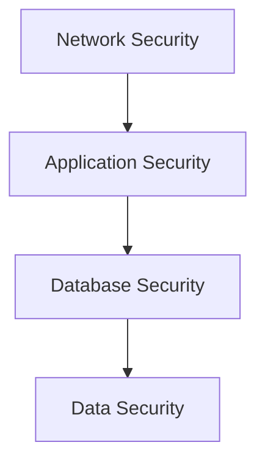
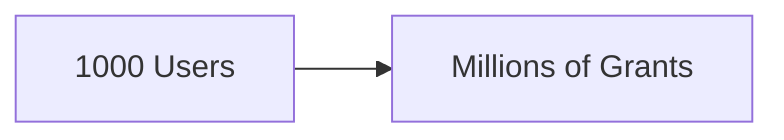
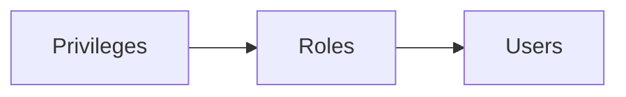
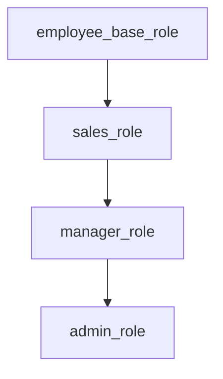
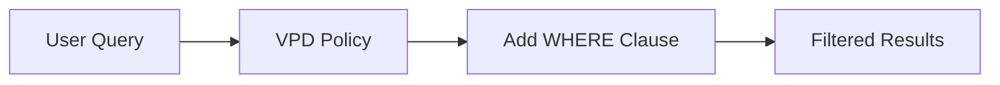
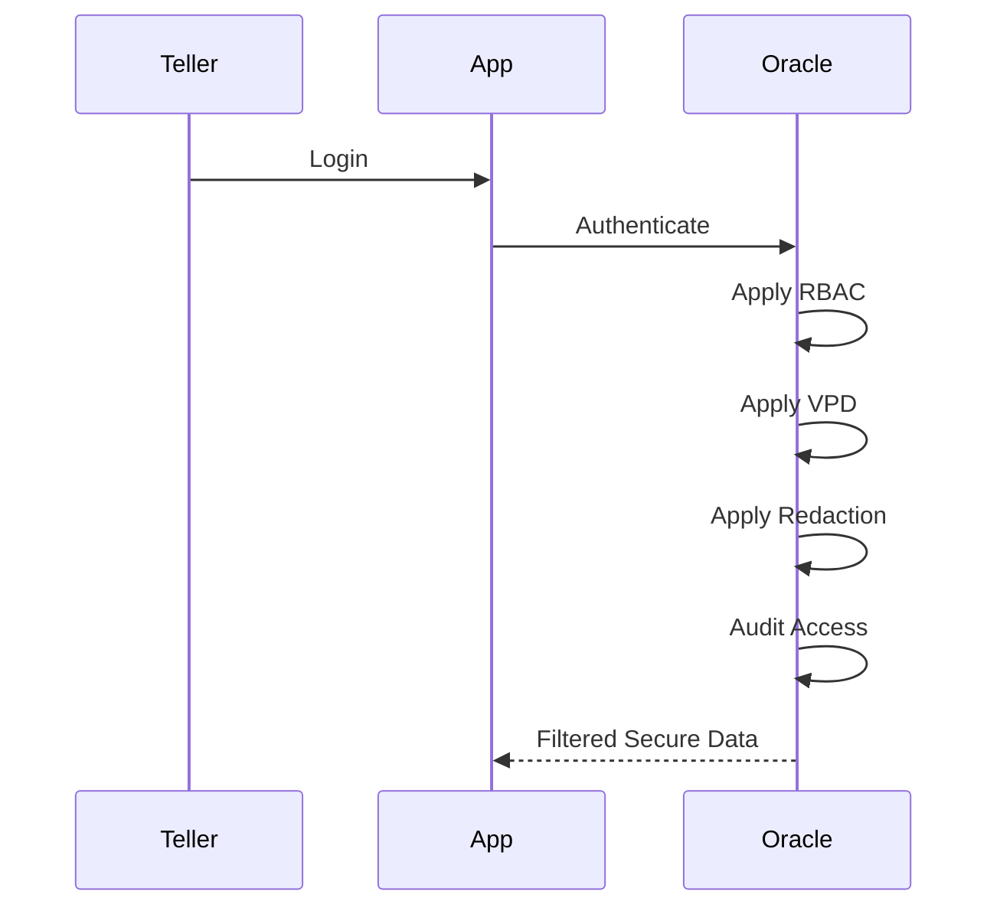
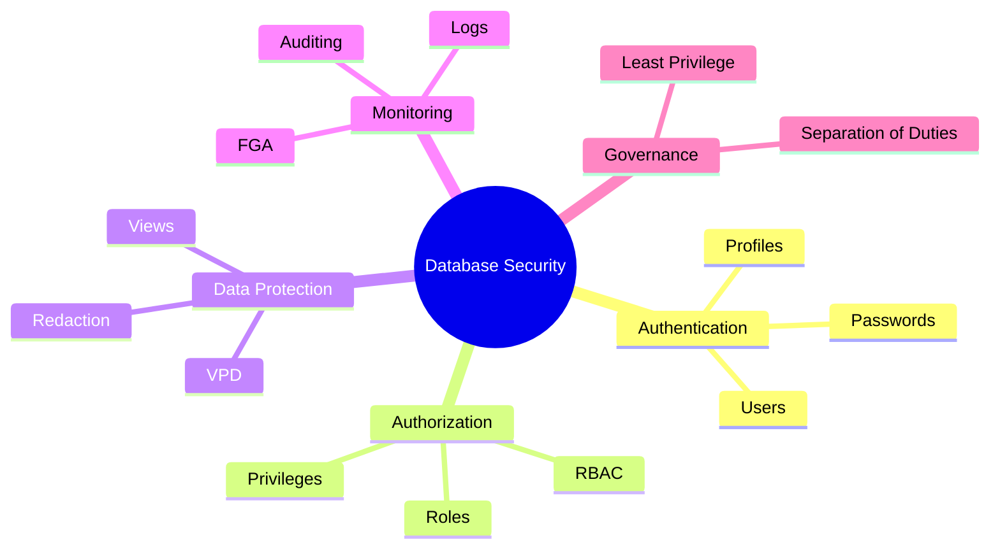

# 🔐 Security Management Using SQL — Enterprise Revision Notes

> **Oracle Database Security | RBAC · Auditing · VPD · Data Protection**
> Focus: Users · Privileges · Roles · Row-Level Security · Auditing · Enterprise Security Architecture

---

# 📌 At a Glance

| Topic           | Purpose                  | Main Goal       |
| --------------- | ------------------------ | --------------- |
| Users & Schemas | Identity management      | Authentication  |
| Privileges      | Permission control       | Authorization   |
| Roles (RBAC)    | Group access control     | Scalability     |
| Views & VPD     | Restrict data visibility | Least privilege |
| Data Redaction  | Mask sensitive data      | Compliance      |
| Auditing        | Track activities         | Accountability  |

---

# 🧠 Core Philosophy of Database Security



---

# 🔥 Why Database Security Matters

Databases contain:

* customer information
* financial transactions
* passwords
* medical records
* business secrets

---

# 🚨 Real-World Security Impact

| Risk              | Consequence              |
| ----------------- | ------------------------ |
| Data breach       | Massive fines            |
| Credential theft  | Unauthorized access      |
| Insider misuse    | Data leaks               |
| No auditing       | Impossible investigation |
| Excess privileges | Lateral movement attacks |

---

# 🧠 Defense in Depth Strategy



---

# 🏛️ USERS vs SCHEMAS

---

# 📌 User

A database account.

```sql
CREATE USER john IDENTIFIED BY "Secure123";
```

Can:

* login
* execute queries
* own objects

---

# 📌 Schema

Collection of objects owned by user.

```text
JOHN.TABLES
JOHN.VIEWS
JOHN.PROCEDURES
```

---

# 🧠 Important Oracle Concept

Creating a user automatically creates a schema.

---

# ⚡ Analogy

| Concept    | Analogy            |
| ---------- | ------------------ |
| User       | Person             |
| Schema     | Their office       |
| Privileges | Access permissions |

---

# 🔐 User Creation

---

# 📌 Basic User

```sql
CREATE USER ecommerce_app
IDENTIFIED BY "StrongPass123";
```

---

# 📌 Enterprise User

```sql
CREATE USER banking_user
IDENTIFIED BY "SecurePass2024"
DEFAULT TABLESPACE banking_data
TEMPORARY TABLESPACE temp
QUOTA 1G ON banking_data
PROFILE banking_security_profile;
```

---

# 🧠 Important Components

| Component          | Purpose                  |
| ------------------ | ------------------------ |
| DEFAULT TABLESPACE | Permanent object storage |
| TEMP TABLESPACE    | Sorting/temp operations  |
| QUOTA              | Storage limit            |
| PROFILE            | Security policies        |

---

# 🚨 Enterprise Reality

Most production systems use:

* service accounts
* application users
* reporting users
* DBA users
* automation users

NOT shared generic accounts.

---

# 🧠 Password Profiles

Profiles enforce security rules.

---

# 📌 Example

```sql
CREATE PROFILE prod_security_profile LIMIT
    PASSWORD_LIFE_TIME 90
    FAILED_LOGIN_ATTEMPTS 5
    PASSWORD_LOCK_TIME 1;
```

---

# 🔥 What Profiles Control

| Feature            | Purpose                |
| ------------------ | ---------------------- |
| Password expiry    | Rotation               |
| Failed login limit | Brute-force protection |
| Idle timeout       | Session security       |
| Session limits     | Resource control       |

---

# 🚨 Hidden Enterprise Problem

Service accounts with:

```text
PASSWORD_LIFE_TIME UNLIMITED
```

often become security nightmares.

Because:

* passwords never rotate
* forgotten accounts remain active
* attackers love stale credentials

---

# ⚠️ Common Security Mistake

```sql
CREATE USER app IDENTIFIED BY app123;
```

Weak passwords are still extremely common internally.

---

# 🔑 PRIVILEGE MANAGEMENT

---

# 🧠 Two Types of Privileges

| Type             | Scope           |
| ---------------- | --------------- |
| System Privilege | Database-wide   |
| Object Privilege | Specific object |

---

# 📌 System Privileges

Examples:

```sql
GRANT CREATE SESSION TO dev_user;
GRANT CREATE TABLE TO dev_user;
```

---

# 🚨 Dangerous System Privileges

| Privilege           | Risk                 |
| ------------------- | -------------------- |
| SELECT ANY TABLE    | Read everything      |
| DROP ANY TABLE      | Destroy data         |
| ALTER ANY TABLE     | Structural damage    |
| GRANT ANY PRIVILEGE | Privilege escalation |

---

# ⚠️ Most Dangerous Mistake

Giving developers:

```sql
DBA
```

in production.

---

# 🧠 Object Privileges

Restrict access to specific objects.

---

# 📌 Example

```sql
GRANT SELECT
ON hr.employees
TO reporting_user;
```

---

# 📌 Column-Level Security

```sql
GRANT SELECT (employee_id, first_name, email)
ON hr.employees
TO portal_user;
```

---

# 🧠 Why Column-Level Security Matters

Prevents exposure of:

* salary
* SSN
* bank details
* medical data

---

# 🚨 Principle of Least Privilege

Users should get:

```text
ONLY the minimum access required.
```

---

# ❌ Bad

```sql
GRANT SELECT ON customers TO everyone;
```

---

# ✅ Better

```sql
GRANT SELECT (customer_name, city)
ON customers TO reporting_role;
```

---

# ⚡ WITH GRANT OPTION vs WITH ADMIN OPTION

---

# 📌 WITH GRANT OPTION

For object privileges.

Allows:

```text
User can pass object access to others.
```

---

# 🚨 Cascade Effect

If revoked:

* downstream users lose access too.

---

# 📌 WITH ADMIN OPTION

For:

* system privileges
* roles

---

# ⚠️ Difference

Revoking from original user:
does NOT revoke from others.

---

# 🧠 ROLE-BASED ACCESS CONTROL (RBAC)

---

# 🚨 Why Roles Exist

Without roles:



Impossible to manage.

---

# ✅ With Roles



Much cleaner.

---

# 📌 Example Role

```sql
CREATE ROLE sales_role;

GRANT SELECT ON sales.customers TO sales_role;
GRANT INSERT ON sales.orders TO sales_role;
```

---

# 📌 Assign Role

```sql
GRANT sales_role TO john;
```

---

# 🧠 Role Hierarchy



---

# 🚨 Enterprise Security Rule

Never assign privileges directly when roles can be used.

Because:

* auditing becomes difficult
* revocation becomes messy
* scaling becomes impossible

---

# ⚠️ Hidden Enterprise Problem

Over time:

```text
Role Explosion
```

happens.

Example:

* sales_role_v2
* sales_role_temp
* sales_role_backup

Chaos.

---

# 🧠 SECURITY VIEWS

Views can hide sensitive data.

---

# 📌 Example

```sql
CREATE VIEW employee_directory AS
SELECT employee_id,
       first_name,
       email
FROM employees;
```

---

# ✅ Users Can See

* names
* emails

---

# ❌ Users Cannot See

* salary
* SSN
* bank accounts

---

# 🚨 Important Limitation

Views are NOT strong security alone.

Because:

* direct table access bypasses them
* optimizer rewrites possible

Need proper privilege control too.

---

# 🔐 ROW-LEVEL SECURITY

---

# 📌 Multi-Tenant Problem

Company A must NOT see Company B data.

---

# ✅ Solution

```sql
WHERE tenant_id = current_tenant
```

automatically enforced.

---

# 🧠 Virtual Private Database (VPD)

Oracle automatically injects filters.

---

# 📌 User Query

```sql
SELECT * FROM customers;
```

---

# ⚡ Oracle Internally Executes

```sql
SELECT *
FROM customers
WHERE tenant_id = 123;
```

---

# 🧠 VPD Flow



---

# 🚨 Why VPD is Powerful

Applications don’t need manual filtering everywhere.

Database enforces security automatically.

---

# ⚠️ Hidden VPD Problem

Complex VPD policies can:

* slow queries
* complicate execution plans
* create debugging nightmares

---

# 🎭 DATA REDACTION

---

# 📌 Goal

Mask sensitive data dynamically.

---

# 📌 Example

Original:

```text
123-45-6789
```

Displayed:

```text
XXX-XX-6789
```

---

# 🧠 Redaction Types

| Type    | Example            |
| ------- | ------------------ |
| FULL    | ****               |
| PARTIAL | XXX-XX-6789        |
| RANDOM  | Random replacement |
| REGEX   | Pattern masking    |

---

# 🚨 Important Security Truth

Redaction is NOT encryption.

Actual data still exists underneath.

---

# 🔍 AUDITING

---

# 📌 Purpose

Track:

* who
* did what
* when
* from where

---

# 📌 Example

```sql
CREATE AUDIT POLICY login_policy
ACTIONS LOGON, LOGOFF;
```

---

# 🧠 Audit Trail Use Cases

| Use Case                 | Example              |
| ------------------------ | -------------------- |
| Compliance               | GDPR                 |
| Forensics                | Breach investigation |
| Insider threat detection | Suspicious access    |
| Monitoring               | Failed logins        |

---

# 🚨 Fine-Grained Auditing (FGA)

Audit only sensitive activity.

---

# 📌 Example

```sql
amount > 100000
```

Only high-value transactions audited.

---

# ⚠️ Hidden Enterprise Problem

Too much auditing:

* increases storage
* slows systems
* creates noisy logs

---

# 🚨 Massive Security Anti-Patterns

---

# ❌ Using DBA Everywhere

Developers should NEVER use DBA in production.

---

# ❌ Shared Accounts

```text
app_user shared by everyone
```

No accountability.

---

# ❌ No Auditing

After breach:

```text
Nobody knows what happened.
```

---

# ❌ Excessive Privileges

Attackers exploit overprivileged accounts.

---

# ❌ Hardcoded Passwords

Very common in:

* scripts
* CI/CD
* applications

Huge security risk.

---

# 🧠 Real-World Banking Security Flow



---

# 📊 Security Layers Comparison

| Layer          | Protects Against   |
| -------------- | ------------------ |
| Authentication | Unauthorized login |
| Authorization  | Excess access      |
| RBAC           | Permission chaos   |
| VPD            | Cross-tenant leaks |
| Redaction      | Sensitive exposure |
| Auditing       | Undetected misuse  |

---

# 🚀 Enterprise Best Practices

| Practice               | Why                       |
| ---------------------- | ------------------------- |
| Use roles              | Easier management         |
| Follow least privilege | Reduce attack surface     |
| Rotate passwords       | Prevent stale credentials |
| Enable auditing        | Accountability            |
| Use VPD                | Automatic row filtering   |
| Mask sensitive data    | Compliance                |
| Separate duties        | Prevent abuse             |

---

# 🧠 Most Important Interview Concepts

| Concept           | Importance |
| ----------------- | ---------- |
| Least Privilege   | ⭐⭐⭐⭐⭐      |
| RBAC              | ⭐⭐⭐⭐⭐      |
| VPD               | ⭐⭐⭐⭐⭐      |
| Auditing          | ⭐⭐⭐⭐⭐      |
| WITH GRANT OPTION | ⭐⭐⭐⭐       |
| Data Redaction    | ⭐⭐⭐⭐       |
| Profiles          | ⭐⭐⭐⭐       |

---

# 🎯 Ultimate Security Mental Model



---

# 🏁 Final Takeaways

✅ Security is layered, not a single feature
✅ Least privilege is the MOST important principle
✅ Roles scale better than direct grants
✅ VPD provides powerful automatic row-level security
✅ Redaction hides sensitive data dynamically
✅ Auditing is essential for compliance and investigations
✅ Overprivileged accounts are one of the biggest enterprise risks
✅ Security failures are often configuration failures, not technology failures

