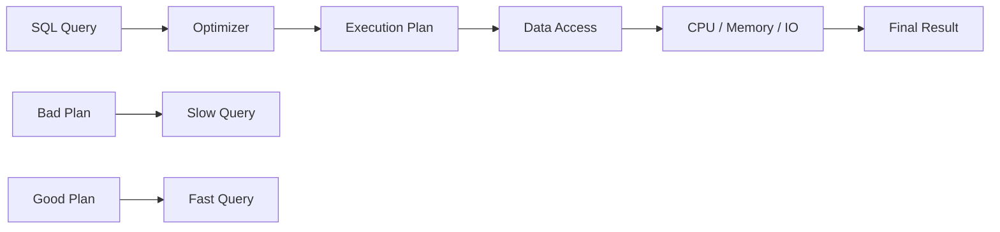
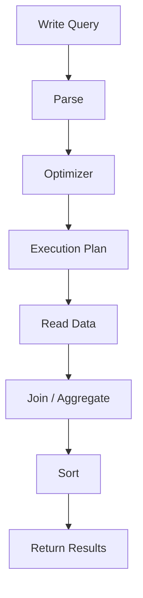
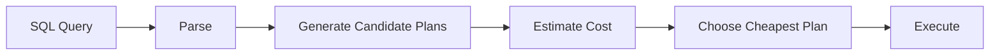
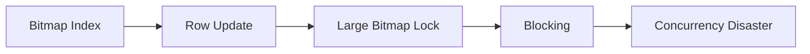
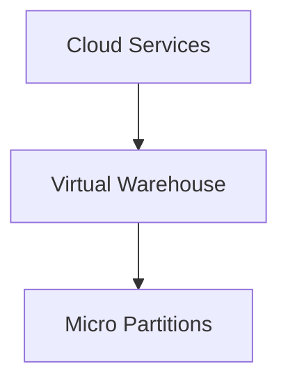
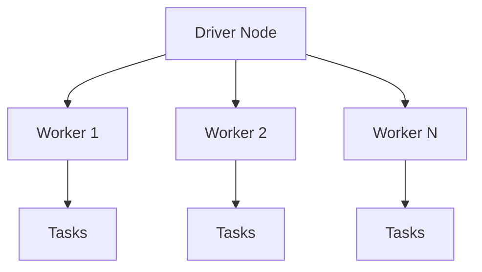
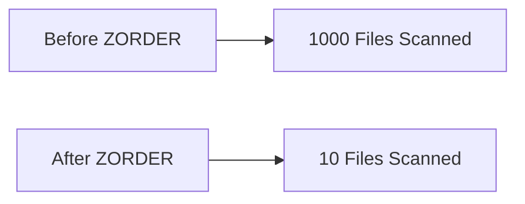
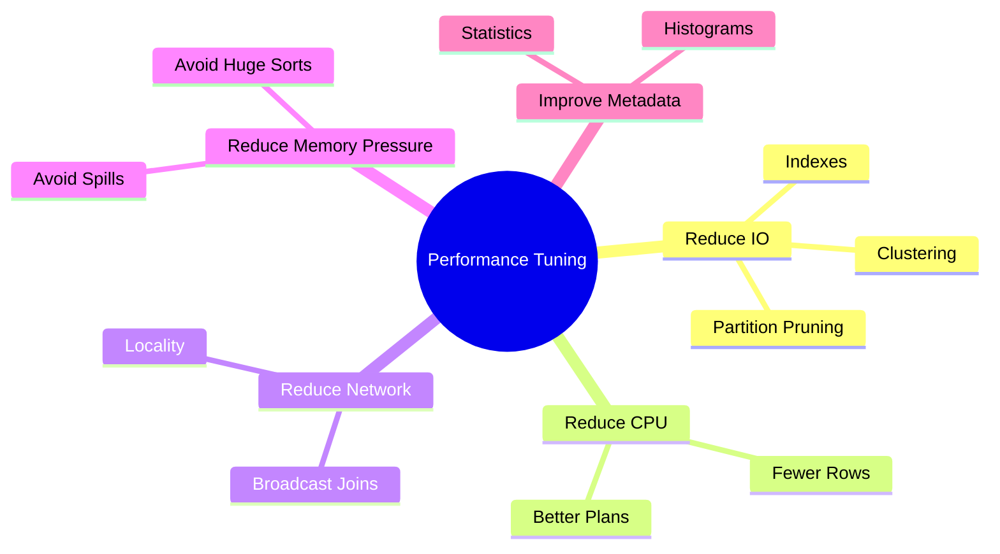

# 🚀 SQL Performance Tuning — Cross-Platform Master Revision

> **Oracle · Snowflake · Databricks | Enterprise Performance Engineering Guide**
> Focus: Query Optimization · Execution Plans · Indexing · Clustering · Partitioning · Distributed Performance

---

# 📌 At a Glance

| Platform   | Architecture             | Main Optimization Strategy |
| ---------- | ------------------------ | -------------------------- |
| Oracle     | Traditional RDBMS        | Indexes + Statistics       |
| Snowflake  | Cloud-native columnar    | Clustering + Pruning       |
| Databricks | Distributed Spark Engine | Partitioning + Z-Ordering  |

---

# 🧠 Core Philosophy of Performance Tuning



---

# 🔥 Universal Golden Rules

| Rule                       | Why It Matters             |
| -------------------------- | -------------------------- |
| Scan less data             | Biggest performance factor |
| Filter early               | Reduce workload            |
| Select fewer columns       | Less IO                    |
| Optimize joins             | Prevent explosions         |
| Keep statistics current    | Better optimizer decisions |
| Understand execution plans | Know what engine is doing  |
| Avoid unnecessary sorting  | Sorting is expensive       |
| Cache wisely               | Avoid recomputation        |

---

# ⚡ Universal Performance Pipeline



---

# 🏛️ ORACLE PERFORMANCE TUNING

---

# 🧠 Oracle Architecture Philosophy

Oracle is:

* row-oriented
* index-heavy
* statistics-driven
* optimizer-centric

Performance depends heavily on:

* indexes
* execution plans
* statistics
* join strategies

---

# ⚙️ Cost-Based Optimizer (CBO)

Oracle evaluates multiple plans and picks the cheapest.

---

# 📌 CBO Flow



---

# 🧠 What Oracle Uses for Decisions

| Input            | Purpose              |
| ---------------- | -------------------- |
| Table statistics | Row count estimation |
| Histograms       | Data distribution    |
| Index statistics | Access cost          |
| CPU cost         | Computation estimate |
| IO cost          | Disk reads estimate  |

---

# 🔍 Execution Plans

---

# 📌 Basic Explain Plan

```sql
EXPLAIN PLAN FOR
SELECT *
FROM employees
WHERE department_id = 10;

SELECT * FROM TABLE(DBMS_XPLAN.DISPLAY);
```

---

# 🧠 Most Important Operations

| Operation         | Meaning                |
| ----------------- | ---------------------- |
| TABLE ACCESS FULL | Full table scan        |
| INDEX RANGE SCAN  | Efficient index access |
| INDEX UNIQUE SCAN | Single-row lookup      |
| HASH JOIN         | Large dataset join     |
| NESTED LOOP       | Small-to-large join    |
| SORT ORDER BY     | Expensive sorting      |
| FILTER            | Predicate filtering    |

---

# 🚨 Massive Beginner Mistake

People focus only on:

```text
COST
```

But real tuning requires:

* cardinality
* rows processed
* memory usage
* IO
* join order

---

# 📊 Oracle Join Strategies

| Join Type       | Best For       | Risk               |
| --------------- | -------------- | ------------------ |
| Nested Loop     | Small → Large  | Slow for huge sets |
| Hash Join       | Large datasets | Memory heavy       |
| Sort Merge Join | Sorted inputs  | Expensive sorting  |

---

# 🧠 Oracle Index Types

---

# 📌 B-Tree Index (Default)

```sql
CREATE INDEX emp_dept_idx
ON employees(department_id);
```

Best for:

* equality
* ranges
* high-cardinality columns

---

# 📌 Composite Index

```sql
CREATE INDEX emp_dept_job_idx
ON employees(department_id, job_id);
```

---

# ⚠️ Leading Column Rule

```sql
(department_id, job_id)
```

---

## ✅ Uses Index

```sql
WHERE department_id = 10
```

---

## ❌ Poor Usage

```sql
WHERE job_id = 'CLERK'
```

Because leading column missing.

---

# 🧠 Bitmap Index

```sql
CREATE BITMAP INDEX emp_gender_idx
ON employees(gender);
```

---

# ✅ Best For

| Scenario                | Why                    |
| ----------------------- | ---------------------- |
| Data warehouses         | Mostly reads           |
| Low-cardinality columns | Few distinct values    |
| Analytics               | Fast bitmap operations |

---

# 🚨 NEVER Use Bitmap Index in OLTP

Why?



---

# 🧠 Function-Based Index

---

# ❌ Problem

```sql
SELECT *
FROM employees
WHERE UPPER(last_name) = 'SMITH';
```

Normal index unusable.

---

# ✅ Solution

```sql
CREATE INDEX emp_upper_idx
ON employees(UPPER(last_name));
```

---

# 🚨 Hidden Problem

Too many function-based indexes:

* increase DML overhead
* increase storage
* increase optimizer complexity

---

# 🧠 Reverse Key Index

---

# ❌ Sequential Inserts Problem

```sql
1
2
3
4
5
```

All inserts hit same index block.

Called:

```text
Hot Block Contention
```

---

# ✅ Reverse Key Fix

```sql
CREATE INDEX order_idx
ON orders(order_id) REVERSE;
```

---

# ⚠️ Limitation

Cannot efficiently do:

```sql
BETWEEN
<
>
```

Range scans become useless.

---

# 🚨 Oracle Anti-Patterns

---

# ❌ Function on Indexed Column

```sql
WHERE TRUNC(order_date) = DATE '2024-01-15'
```

---

# ✅ Better

```sql
WHERE order_date >= DATE '2024-01-15'
AND order_date < DATE '2024-01-16'
```

---

# ❌ Implicit Conversion

```sql
WHERE phone_number = 5551234
```

Oracle converts every row.

---

# ❌ Leading Wildcards

```sql
LIKE '%SMITH%'
```

Index unusable.

---

# ✅ Better

```sql
LIKE 'SMITH%'
```

---

# 🧠 Hidden Enterprise Problem

Even "fast queries" become slow when:

* executed thousands of times/sec
* poor bind variable usage
* hard parsing occurs

---

# 🚨 Bind Variable Issue

```sql
WHERE employee_id = :id
```

is better than:

```sql
WHERE employee_id = 100
```

for scalability.

---

# 🧠 Statistics Management

---

# 📌 Gather Statistics

```sql
EXEC DBMS_STATS.GATHER_TABLE_STATS(
    ownname => 'HR',
    tabname => 'EMPLOYEES'
);
```

---

# ⚠️ Outdated Statistics Cause

| Problem             | Effect        |
| ------------------- | ------------- |
| Wrong row estimates | Bad plan      |
| Wrong join type     | Huge slowdown |
| Full scans          | Massive IO    |

---

# ❄️ SNOWFLAKE PERFORMANCE TUNING

---

# 🧠 Snowflake Philosophy

Snowflake has:

* NO traditional indexes
* automatic micro-partitions
* columnar storage
* separation of storage & compute

---

# 🏗️ Snowflake Architecture



---

# 🧠 Core Optimization Concept

```text
PRUNING
```

Snowflake skips unnecessary micro-partitions.

---

# 📦 Micro-Partitions

| Feature          | Description            |
| ---------------- | ---------------------- |
| Size             | 50–500 MB compressed   |
| Immutable        | Cannot update directly |
| Metadata tracked | Min/max statistics     |
| Automatic        | No manual partitioning |

---

# 🧠 Query Profile

Snowflake tuning mostly revolves around Query Profile.

---

# 📊 Key Metrics

| Metric             | Meaning              |
| ------------------ | -------------------- |
| Partitions scanned | How much data read   |
| Bytes scanned      | IO cost              |
| Spill to disk      | Memory shortage      |
| Queue time         | Warehouse overloaded |

---

# 🚨 Biggest Snowflake Optimization

Reduce:

```text
Partitions Scanned
```

---

# 🧠 Clustering Keys

Snowflake’s "index-like" optimization.

---

# 📌 Example

```sql
ALTER TABLE orders
CLUSTER BY (order_date);
```

---

# ✅ Best Columns for Clustering

| Good Choice  | Why                |
| ------------ | ------------------ |
| Dates        | Range filtering    |
| Regions      | Repeated filtering |
| Join columns | Better pruning     |

---

# ❌ Bad Clustering Key

```sql
order_id
```

Too unique.

High cardinality destroys clustering efficiency.

---

# 📌 Clustering Depth

```sql
SELECT SYSTEM$CLUSTERING_DEPTH('orders');
```

---

# 🧠 Interpretation

| Depth | Meaning         |
| ----- | --------------- |
| 1–2   | Excellent       |
| 3–5   | Acceptable      |
| 10+   | Poor clustering |

---

# 🚨 Snowflake Anti-Patterns

---

# ❌ SELECT *

```sql
SELECT *
FROM huge_table
```

Columnar systems suffer badly from unnecessary columns.

---

# ❌ ORDER BY Without LIMIT

Sorting billions of rows is expensive.

---

# ❌ UDF in WHERE

```sql
WHERE my_udf(order_date)
```

Prevents pruning.

---

# ❌ Exploding Joins

Low-cardinality joins:

```sql
category = category
```

cause massive row multiplication.

---

# 🧠 Snowflake Warehouse Sizing

---

# Scale UP vs Scale OUT

| Strategy  | Meaning          |
| --------- | ---------------- |
| Scale Up  | Bigger warehouse |
| Scale Out | More clusters    |

---

# ✅ Use Scale Up For

* complex aggregations
* huge joins
* memory spills

---

# ✅ Use Scale Out For

* concurrency
* many simultaneous users

---

# 🧠 Snowflake Caching

Snowflake has:

1. result cache
2. local SSD cache
3. remote cache

---

# 🚨 Result Cache Trap

This query may appear "fast":

```sql
SELECT COUNT(*) FROM orders;
```

because it came from cache.

Not actual execution.

---

# ⚡ Force Fresh Execution

```sql
ALTER SESSION SET USE_CACHED_RESULT = FALSE;
```

---

# 🚀 DATABRICKS PERFORMANCE TUNING

---

# 🧠 Databricks Philosophy

Databricks is:

* distributed
* Spark-based
* file-oriented
* Delta Lake optimized

Main bottlenecks:

* shuffles
* skew
* small files
* network movement

---

# 🏗️ Spark Architecture



---

# 🚨 Most Important Spark Cost

```text
SHUFFLE
```

---

# ⚠️ Shuffle Means

Data moved across network.

Very expensive.

---

# 📌 Execution Plan Keywords

| Keyword           | Meaning           |
| ----------------- | ----------------- |
| Exchange          | Shuffle           |
| BroadcastHashJoin | Efficient         |
| SortMergeJoin     | Expensive         |
| Scan parquet      | File read         |
| Filter pushdown   | Good optimization |

---

# 🧠 Partitioning

---

# ✅ Good Partitioning

```sql
PARTITIONED BY (sale_date)
```

---

# ❌ Bad Partitioning

```sql
PARTITIONED BY (user_id)
```

Millions of partitions.

---

# 🚨 Small File Problem

Thousands of tiny files kill performance.

---

# 📌 Symptoms

| Symptom                   | Cause             |
| ------------------------- | ----------------- |
| Slow reads                | Metadata overhead |
| Driver overload           | Too many files    |
| High task scheduling time | Fragmentation     |

---

# ✅ Solution

```sql
OPTIMIZE sales;
```

---

# 🧠 Z-Ordering

Databricks equivalent of clustering.

---

# 📌 Example

```sql
OPTIMIZE sales
ZORDER BY (customer_id);
```

---

# 🧠 What It Does

Co-locates similar values in same files.

---

# 🚀 Benefit



---

# 🧠 Broadcast Joins

---

# ✅ Best Scenario

Small table + large table.

---

# 📌 Example

```sql
SELECT /*+ BROADCAST(d) */
*
FROM large_table l
JOIN dim_table d
ON l.id = d.id;
```

---

# 🚨 Why It's Fast

Instead of shuffling both tables:

* small table copied to all workers

---

# 📌 AQE (Adaptive Query Execution)

One of Spark’s strongest features.

---

# AQE Can Automatically

| Optimization     | Purpose             |
| ---------------- | ------------------- |
| Convert joins    | Faster strategy     |
| Handle skew      | Prevent bottlenecks |
| Merge partitions | Reduce tiny tasks   |
| Optimize shuffle | Better execution    |

---

# 🚨 Databricks Anti-Patterns

---

# ❌ collect()

```python
df.collect()
```

Loads everything into driver memory.

Can crash cluster.

---

# ❌ Python UDFs

Much slower than native Spark functions.

---

# ❌ Over-Partitioning

Millions of partitions = metadata nightmare.

---

# ❌ Cartesian Joins

Explosive row multiplication.

---

# ⚡ Cross-Platform Comparison

| Feature             | Oracle  | Snowflake | Databricks |
| ------------------- | ------- | --------- | ---------- |
| Traditional indexes | ✅       | ❌         | ❌          |
| Distributed engine  | ❌       | Partial   | ✅          |
| Auto scaling        | Limited | ✅         | ✅          |
| Partition pruning   | Manual  | Automatic | Manual     |
| Best for OLTP       | ✅       | ❌         | ❌          |
| Best for analytics  | Medium  | ✅         | ✅          |
| Best for ML         | ❌       | Medium    | ✅          |

---

# 🎯 Platform Strengths

| Scenario               | Best Platform |
| ---------------------- | ------------- |
| Banking OLTP           | Oracle        |
| Ad-hoc analytics       | Snowflake     |
| ML + Streaming         | Databricks    |
| Enterprise warehousing | Snowflake     |
| Distributed ETL        | Databricks    |

---

# 🚨 Most Important Enterprise Problems

| Platform   | Biggest Problem        |
| ---------- | ---------------------- |
| Oracle     | Bad indexes/statistics |
| Snowflake  | Excessive scanning     |
| Databricks | Shuffle + small files  |

---

# 🧠 Universal Performance Mental Model



---

# 🚀 Ultimate Performance Checklist

## Universal

* Avoid SELECT *
* Filter early
* Use proper joins
* Avoid unnecessary sorting
* Keep statistics current
* Reduce scanned data

---

## Oracle

* Proper indexes
* Fresh statistics
* Avoid implicit conversions
* Avoid functions on indexed columns

---

## Snowflake

* Use clustering keys
* Optimize warehouse sizing
* Verify pruning
* Use materialized views carefully

---

## Databricks

* Partition wisely
* Use ZORDER
* OPTIMIZE regularly
* Avoid small files
* Use AQE

---

# 🏁 Final Takeaways

✅ Performance tuning is mostly about reducing unnecessary work
✅ Oracle optimizes through indexes + statistics
✅ Snowflake optimizes through pruning + clustering
✅ Databricks optimizes through distributed execution + file organization
✅ Execution plans are the MOST important debugging tool
✅ Bad joins and unnecessary scans are universal performance killers
✅ Distributed systems suffer heavily from shuffles and skew
✅ Tuning is not just SQL optimization — it’s architecture optimization too
