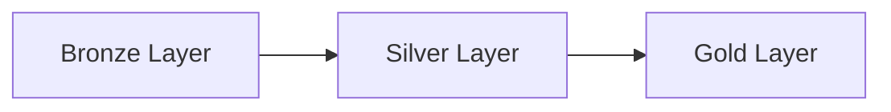

Welcome back! It is completely normal to feel like you only remember 10% of a topic after a long time away from it. I have rewritten your Data Engineering Lifecycle notes into a highly visual, simplified cheat sheet—just like the SQL guide you provided.

I stripped away the dense paragraphs and focused purely on the core concepts you need to know. At the end, there is a quick quiz to test your memory!

---

# 🚀 Data Engineering Lifecycle — Complete Revision Notes

> **Foundations | Ingestion · Storage · Transformation · Serving · DataOps**

---

# 📌 Module Overview

| Phase | Main Purpose | Key Question |
| --- | --- | --- |
| **1. Generation** | Source systems where data originates | What data exists?

 |
| **2. Collection & Ingestion** | Moving data from sources to platform | Batch or stream?

 |
| **3. Storage & Processing** | Where and how data is stored | Lake or warehouse?

 |
| **4. Transformation** | Converting raw data to usable formats | How do we clean and join?

 |
| **5. Serving & Analytics** | Making data available for consumption | How do users access insights?

 |
| **6. Operations & Monitoring** | Maintaining system health | How do we ensure reliability?

 |

---

# 🧠 The "Undercurrents"

These 6 things run in the background of *every single phase*:

1. **Security** (Protecting data)

2. **Data Management** (Governance and quality)

3. **DataOps** (Automation and collaboration)

4. **Data Architecture** (Storage and compute design)

5. **Orchestration** (Scheduling workflows)

6. **Software Engineering** (Building reliable systems)

---

# 📊 PHASE 1: GENERATION (The Birth of Data)

---

# 🧠 The 3 V's of Data

When looking at a new data source, ask yourself:

* **VOLUME**: How much data? (GBs vs PBs)

* **VELOCITY**: How fast? (Real-time vs Batch)

* **VARIETY**: What format? (Structured vs Unstructured)

---

# ⚡ PHASE 2: INGESTION (Moving the Data)

---

# 🧠 The 3 Ways to Move Data

| Pattern | Speed / Latency | Cost | Best For |
| --- | --- | --- | --- |
| **Batch** | Hours to days | Lower | Large historical data, ML training

 |
| **Streaming** | Seconds to minutes | Higher | Real-time dashboards, IoT events

 |
| **CDC** (Change Data Capture) | Seconds to minutes | Medium | Syncing databases, only moving *updated* rows

 |

---

# 🚨 Interview Favorite: ETL vs ELT

**ETL (Extract -> Transform -> Load)**

* Old school way.

* Data is cleaned/transformed *before* it gets loaded into the target database.

**ELT (Extract -> Load -> Transform)**

* Modern approach.

* Dump the raw data into a powerful Cloud Warehouse first, then transform it *inside* the warehouse.

---

# 🗄️ PHASE 3: STORAGE

---

# 🧠 The Big Three Storage Types

| Data Warehouse | Data Lake | Data Lakehouse |
| --- | --- | --- |
| **Structured** data only

 | **Any** data type (images, JSON)

 | **Best of both**  |
| Schema-on-write

 | Schema-on-read

 | ACID transactions on cheap lake storage

 |
| Expensive

 | Cheap

 | Medium cost

 |
| Best for: BI / Reporting

 | Best for: Raw dumping / ML

 | Best for: Unified analytics

 |

---

# ⚡ Storage Optimization Magic

* **Separation of Compute & Storage**: Modern tools let you pay for storage and processing power separately, saving money.

* **Parquet format**: The best file format for analytics because it is heavily compressed and lightning-fast to query.

---

# 🔄 PHASE 4: TRANSFORMATION

---

# 🧠 The Medallion Architecture

The standard way to organize and clean your data as it flows.

---

# 📌 BRONZE (Raw)

* Exact copy of the source data.

* Unvalidated; landing zone.

# 📌 SILVER (Cleaned)

* Deduplicated and standardized.

* Enterprise view.

# 📌 GOLD (Business-Ready)

* Aggregated for specific dashboards or ML models.

* Production quality.

---

# 🎯 PHASE 5: SERVING (Delivering Value)

---

# 🧠 Where does the data go next?

1. **Analytics & BI**: Sending Gold data to Tableau or Power BI.

2. **Machine Learning**: Feeding data into a "Feature Store" for AI.

3. **Reverse ETL**: Pushing cleaned warehouse data *back* into apps like Salesforce or Zendesk.

---

# 🚨 CRITICAL INTERVIEW POINT

**Reverse ETL** is exactly what it sounds like. Instead of bringing data *in* (ETL), you are sending your perfectly calculated metrics *out* to the sales and marketing teams' everyday tools.

---

# 👁️ PHASE 6: OPERATIONS & MONITORING

---

# 🧠 Data Observability

You must monitor your data pipelines so you know they broke *before* your boss does.

### The 5 Pillars of Observability

:

| Pillar | What it checks |
| --- | --- |
| **Freshness** | Is the data recent?

 |
| **Distribution** | Are the values in expected ranges?

 |
| **Volume** | Did all the expected rows arrive?

 |
| **Schema** | Did the source add or drop a column?

 |
| **Lineage** | If this breaks, which downstream dashboard dies?

 |

---

# 🤝 STAKEHOLDER MANAGEMENT

---

# 🧠 Why it matters

Pipelines are useless if they don't solve business problems.

* **Data Scientists** want raw, accessible data.

* **Executives** want high-level metrics without jargon.

* **Business Users** want self-service, easy-to-use dashboards.

* Always clarify the business goal *before* you build the pipeline!

---

# 🧠 PRACTICE QUIZ

**1. A business team needs a dashboard updated every morning at 8 AM. Which ingestion pattern is the most cost-effective choice?**
A) Streaming Ingestion
B) Batch Ingestion
C) CDC
**Answer:** B) Batch Ingestion. It is 5-10x cheaper than streaming and is perfect when data only needs to be fresh on a daily/hourly basis.

**2. What is the main difference between a Data Warehouse and a Data Lake?**
A) A Data Warehouse handles any data type; a Data Lake only handles structured data.
B) A Data Warehouse uses Schema-on-write; a Data Lake uses Schema-on-read.
C) Data Lakes have built-in ACID transactions; Data Warehouses do not.
**Answer:** B. Data Warehouses force a rigid structure (Schema-on-write), while Data Lakes accept raw, flexible formats like JSON or images (Schema-on-read).

**3. In the Medallion Architecture, which layer contains heavily aggregated, "business-ready" data meant for BI dashboards?**
A) Bronze
B) Silver
C) Gold
**Answer:** C) Gold. The Gold layer provides production-quality data optimized for specific business use cases.

**4. Verbal Question: What is "Reverse ETL"?**
**Answer:** Reverse ETL is the process of extracting data from your central Data Warehouse and syncing it *back* out to operational systems like Salesforce, HubSpot, or Zendesk.

**5. A pipeline usually loads 10,000 rows a day, but today it only loaded 5 rows. Which "Pillar of Data Observability" would catch this error?**
A) Freshness
B) Volume
C) Schema
**Answer:** B) Volume. Volume checks monitor row counts to ensure all expected data has successfully arrived.