# 🚀 Data Engineering — Section 2: Quick Revision
> **Enterprise Data Engineering Masterclass | v3.0**  
> 9/11 Lectures Complete | Section 2: Project Lifecycle

---

## 📌 At a Glance

| Phase | Name                      | Key Tool / Method                       |
| ----- | ------------------------- | --------------------------------------- |
| 1     | Data Generation at Source | Kafka, REST APIs, CDC                   |
| 2     | Collection & Ingestion    | Batch / Stream / CDC                    |
| 3     | Storage & Processing      | Warehouse / Lake / Lakehouse            |
| 4     | Transformation            | dbt, Spark, Medallion Architecture      |
| 5     | Serving & Analytics       | Tableau, ML Feature Stores, Reverse ETL |
| 6     | Operations & Monitoring   | DataOps, Observability                  |

---

## 🗺️ Lifecycle Overview (Lecture 13)

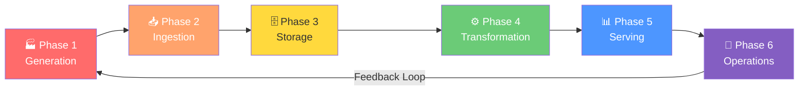

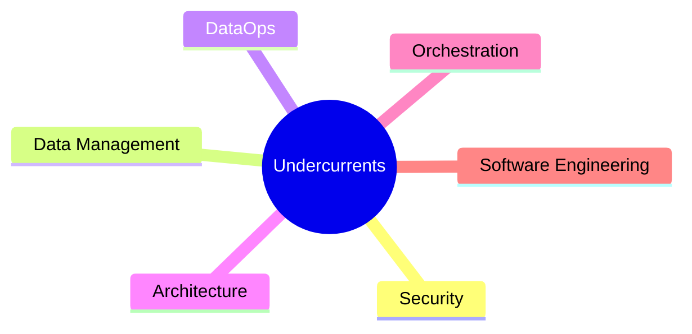

<details>
<summary><strong>📖 Lecture 13 Details — DE Project Lifecycle Overview</strong></summary>

### Core Idea
Data engineering is about managing the **entire data lifecycle**, not just tools. Engineers are becoming **Data Lifecycle Engineers**.

### Project Lifecycle vs Data Lifecycle

| Aspect   | Data Lifecycle       | DE Lifecycle            |
| -------- | -------------------- | ----------------------- |
| Scope    | Creation → Disposal  | Stages controlled by DE |
| Includes | Archival, compliance | Ingestion to serving    |
| Owner    | Organization-wide    | DE Team                 |

### The 6 Undercurrents (run through ALL phases)
1. **Security** — protect data throughout
2. **Data Management** — governance, quality, metadata
3. **DataOps** — DevOps for data
4. **Data Architecture** — storage, compute, networking design
5. **Orchestration** — Airflow, Dagster, Prefect
6. **Software Engineering** — reliable, testable systems

### Key Takeaways
- Think **holistically** — beyond just technologies
- The lifecycle is **iterative**, not linear
- Every phase must deliver **business value**

</details>

---

## 🏭 Phase 1 — Data Generation at Source (Lecture 14)

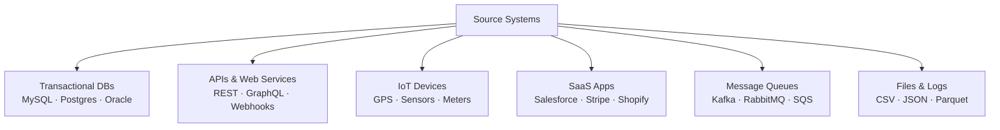

<details>
<summary><strong>📖 Lecture 14 Details — Phase 1: Data Generation</strong></summary>

### What is Data Generation?
The **birth of the data lifecycle** — where data is created before entering pipelines. Data engineers **consume**, not control, these systems.

> 💡 Average enterprise uses **400+ data sources**!

### Source System Types

| Category             | Examples            | Characteristics            |
| -------------------- | ------------------- | -------------------------- |
| Transactional (OLTP) | ERP, CRM, POS       | High volume, row-oriented  |
| Analytical (OLAP)    | Data marts, cubes   | Aggregated, historical     |
| Files & Logs         | CSV, JSON, logs     | Various formats            |
| APIs                 | REST, GraphQL, SOAP | Structured, rate-limited   |
| IoT/Sensors          | Temperature, GPS    | High velocity, time-series |
| SaaS Apps            | Salesforce, Stripe  | API-dependent              |
| Message Queues       | Kafka, RabbitMQ     | Real-time, ordered         |

### The 3 V's of Data
```
        VOLUME (how much?)
           /        \
    VELOCITY     VARIETY
  (how fast?)  (what types?)
           \        /
           VERACITY
         (how accurate?)
```

### Key Evaluation Questions
- What data is generated? (schema, format)
- How often? (real-time, hourly, daily)
- At what volume?
- Who owns it? (internal, vendor, third-party)
- How stable is the schema?
- What access methods exist?

### Challenges with Source Systems

| Challenge           | Mitigation                 |
| ------------------- | -------------------------- |
| Schema drift        | Schema validation, alerts  |
| Data quality issues | Data contracts, validation |
| Rate limits / auth  | Caching, retry logic       |
| System downtime     | Retry + buffering          |
| Late-arriving data  | Watermarks, reprocessing   |

</details>

---

## 📥 Phase 2 — Collection & Ingestion (Lecture 15)

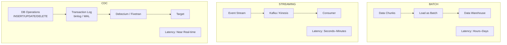

<details>
<summary><strong>📖 Lecture 15 Details — Phase 2: Data Collection & Ingestion</strong></summary>

### Ingestion Pattern Comparison

| Factor          | Batch                 | Streaming           | CDC                   |
| --------------- | --------------------- | ------------------- | --------------------- |
| Latency         | Hours–Days            | Seconds–Minutes     | Seconds–Minutes       |
| Data Volume     | High (TBs/batch)      | Continuous (GBs/hr) | Only changes (MBs/hr) |
| Source Impact   | High (full scans)     | N/A                 | Low (log reads)       |
| Cost            | Lower (5–10× cheaper) | Higher (always-on)  | Medium                |
| Complexity      | Simpler (stateless)   | Complex (stateful)  | Moderate              |
| Handles Deletes | Yes (full refresh)    | Depends on source   | Yes (log-based)       |

### When to Use Each

**Use Batch when:**
- Data freshness = hours or days
- ML model training
- Cost optimization

**Use Streaming when:**
- Real-time dashboards / alerts
- IoT event processing
- Fraud detection

**Use CDC when:**
- Syncing operational DB → warehouse
- Audit trail needed
- Incremental updates more efficient

### ETL vs ELT

|                    | ETL                            | ELT                            |
| ------------------ | ------------------------------ | ------------------------------ |
| Order              | Extract → **Transform** → Load | Extract → Load → **Transform** |
| Transform location | External ETL server            | Inside cloud warehouse         |
| Tools              | Informatica, Talend            | Snowflake, BigQuery            |
| Approach           | Traditional                    | Modern                         |

### Key Ingestion Tools

| Category      | Tools                        |
| ------------- | ---------------------------- |
| Managed ELT   | Fivetran, Airbyte, Stitch    |
| Streaming     | Apache Kafka, AWS Kinesis    |
| CDC           | Debezium, AWS DMS            |
| Batch ETL     | AWS Glue, Azure Data Factory |
| Orchestration | Airflow, Dagster, Prefect    |

### Engineering Considerations
- **Reliability**: Retry logic + dead-letter queues
- **Scalability**: Design for 10× current volume
- **Idempotency**: Reprocessing ≠ duplicates
- **Monitoring**: Latency, throughput, errors
- **Schema Evolution**: Handle source changes

</details>

---

## 🗄️ Phase 3 — Storage & Processing (Lecture 16)

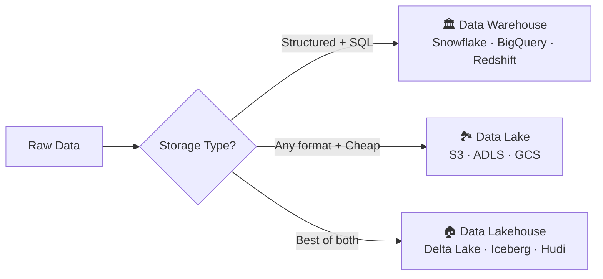

<details>
<summary><strong>📖 Lecture 16 Details — Phase 3: Storage & Processing</strong></summary>

### Storage Paradigms Comparison

| Feature           | Data Warehouse  | Data Lake | Data Lakehouse |
| ----------------- | --------------- | --------- | -------------- |
| Data Types        | Structured only | All types | All types      |
| Schema            | On-write        | On-read   | Both           |
| ACID Transactions | ✅ Yes           | ❌ No      | ✅ Yes          |
| Query Performance | Excellent       | Variable  | Good–Excellent |
| Cost              | Higher          | Lower     | Medium         |
| ML/AI Support     | Limited         | Excellent | Excellent      |
| Governance        | Built-in        | Manual    | Built-in       |

### Open Table Formats (power the Lakehouse)

| Format             | Origin     | Strength          |
| ------------------ | ---------- | ----------------- |
| **Delta Lake**     | Databricks | Most adopted      |
| **Apache Iceberg** | Netflix    | Growing adoption  |
| **Apache Hudi**    | Uber       | Streaming-focused |

**All provide:** ACID on object storage · Time travel · Schema evolution · Efficient upserts/deletes

### Separation of Storage & Compute

```
TRADITIONAL                 MODERN
─────────────               ──────
[DB Server]                 [Compute Layer]  ← Scale up/down
  ├─ Compute    vs                 ↕
  └─ Storage                [Storage Layer]  ← Pay per store
  (tightly coupled)         (scale independently)
```

### File Format Guide

| Format      | Best For                    | Query Speed       |
| ----------- | --------------------------- | ----------------- |
| **Parquet** | Analytics                   | ⚡ Fast (columnar) |
| **ORC**     | Hive ecosystem              | ⚡ Fast (columnar) |
| **Avro**    | Streaming, schema evolution | 🔄 Medium          |
| **JSON**    | Flexibility                 | 🐢 Slow            |
| **CSV**     | Compatibility               | 🐢 Slow            |

### Storage Optimization
1. **Partitioning** — by date, region (filtered columns)
2. **Clustering / Z-Ordering** — co-locate related data
3. **Compaction** — merge small files → larger ones

</details>

---

## ⚙️ Phase 4 — Data Transformation (Lecture 17)

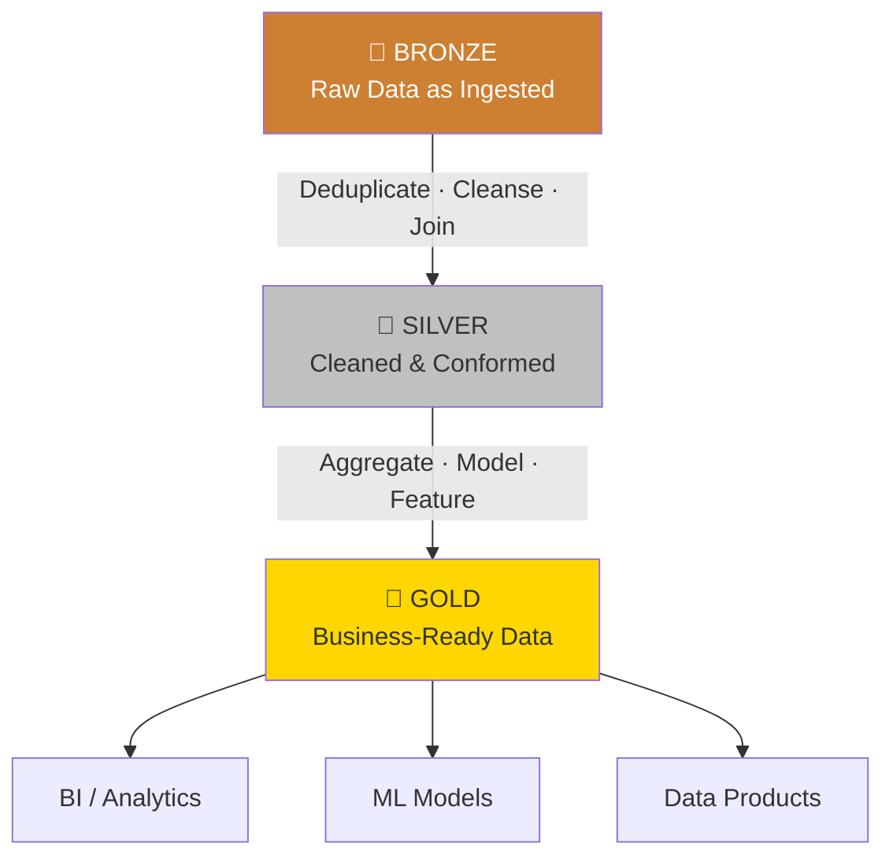

<details>
<summary><strong>📖 Lecture 17 Details — Phase 4: Data Transformation</strong></summary>

### Medallion Architecture Layers

| Layer    | Purpose             | Data Quality       | Access                  |
| -------- | ------------------- | ------------------ | ----------------------- |
| 🥉 Bronze | Raw landing zone    | Unvalidated        | Data engineers only     |
| 🥈 Silver | Cleaned & conformed | Validated          | Data team + power users |
| 🥇 Gold   | Business-ready      | Production-quality | All stakeholders        |

### Types of Transformations

**1. Data Cleansing**
- Remove duplicates
- Handle null values
- Fix data types
- Correct inconsistencies

**2. Data Enrichment**
- Add calculated fields
- Join with reference data
- Geocoding, currency conversion

**3. Data Aggregation**
- Sum, count, average
- Group by dimensions
- Rolling windows

**4. Normalization / Denormalization**
- Flatten nested structures
- Star/snowflake schemas

### dbt (Data Build Tool)
```sql
-- Example: dbt Silver model
SELECT
    customer_id,
    LOWER(TRIM(email))   AS email,
    INITCAP(first_name)  AS first_name,
    COALESCE(phone, 'Unknown') AS phone
FROM {{ source('bronze', 'raw_customers') }}
WHERE email IS NOT NULL
```

**dbt Key Features:**
- SQL-based transformations
- Git version control
- Built-in testing
- Auto-documentation
- DAG dependency management

### Transformation Tools

| Tool             | Best For                 | Complexity |
| ---------------- | ------------------------ | ---------- |
| **dbt**          | Warehouse SQL transforms | Low        |
| **Apache Spark** | Large-scale distributed  | High       |
| **Dataform**     | GCP-native (BigQuery)    | Low        |
| **AWS Glue**     | AWS ecosystem            | Medium     |
| **Apache Flink** | Real-time streaming      | High       |

### Best Practices
- ✅ **Idempotency** — same result every run
- ✅ **Incremental** — only process new/changed data
- ✅ **Testing** — validate business logic
- ✅ **Modularity** — reusable components
- ✅ **Version Control** — Git for all transform code

</details>

---

## 📊 Phase 5 — Data Serving & Analytics (Lecture 18)

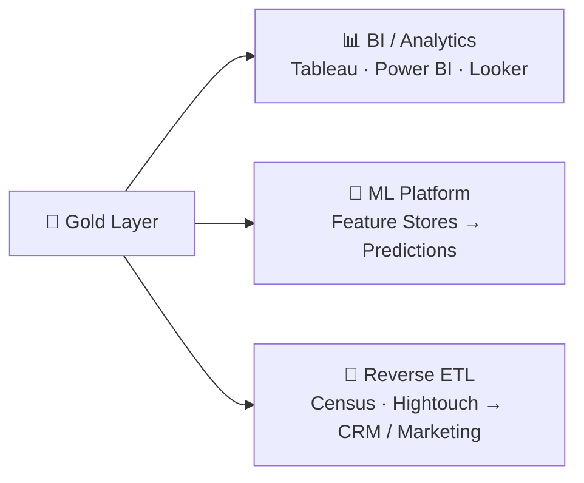

<details>
<summary><strong>📖 Lecture 18 Details — Phase 5: Data Serving</strong></summary>

### Analytics Types

| Type                  | Description                              | Latency         |
| --------------------- | ---------------------------------------- | --------------- |
| Business Analytics    | Strategic decisions — revenue, forecasts | Daily / Weekly  |
| Operational Analytics | Real-time ops — inventory, system health | Minutes / Hours |
| Embedded Analytics    | In-app stats, recommendations            | Real-time       |
| Self-Service          | Ad-hoc queries, data discovery           | On-demand       |

### Reverse ETL — Closing the Loop
Send enriched warehouse data **back** to operational tools:

```
[Data Warehouse]
      ↓
[Reverse ETL Tool]  ← Census, Hightouch
      ↓
[Salesforce] [HubSpot] [Zendesk]

Use Cases:
• Lead scores → Salesforce
• Customer segments → Marketing automation  
• Health scores → Customer success
• Product usage → CRM for sales context
```

### Feature Store (for ML)

| Store Type         | Purpose                       |
| ------------------ | ----------------------------- |
| Offline Store      | ML model training             |
| Online Store       | Real-time prediction serving  |
| Streaming Features | Real-time feature computation |

### Semantic Layer
A unified business view between physical tables and end users:
- Metrics (Revenue, Conversion Rate)
- Dimensions (Date, Region)
- Business Logic
- Access Controls

**Tools:** dbt Semantic Layer · Cube · LookML · AtScale

### Serving Tools

| Category       | Tools                     |
| -------------- | ------------------------- |
| BI Platforms   | Tableau, Power BI, Looker |
| Reverse ETL    | Census, Hightouch         |
| Feature Stores | Feast, Tecton, Databricks |
| Semantic Layer | dbt Semantic Layer, Cube  |

</details>

---

## 🔭 Phase 6 — Data Operations & Monitoring (Lecture 19)

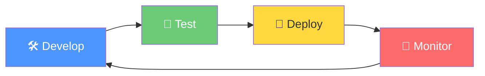

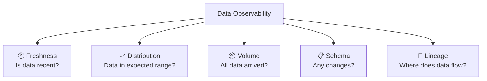

<details>
<summary><strong>📖 Lecture 19 Details — Phase 6: DataOps & Monitoring</strong></summary>

### DataOps = DevOps + Data
Applies DevOps principles (collaboration, automation, continuous improvement) to data workflows.

> 💬 *"You can't have DataOps without data observability."*

### 5 Pillars of Data Observability

| Pillar           | Question                 | Example Check              |
| ---------------- | ------------------------ | -------------------------- |
| **Freshness**    | Is data recent?          | Last update > 24h ago?     |
| **Distribution** | Data in expected ranges? | Null rate jumped 50%?      |
| **Volume**       | All data arrived?        | Row count dropped?         |
| **Schema**       | Schema changed?          | New column? Type change?   |
| **Lineage**      | Where does data flow?    | Which dashboards affected? |

### Key Metrics to Monitor

| Category        | Metrics                          | Tools                         |
| --------------- | -------------------------------- | ----------------------------- |
| Pipeline Health | Success rate, duration, failures | Airflow, Dagster              |
| Data Quality    | Null rates, uniqueness, ranges   | Great Expectations, dbt tests |
| Freshness       | Last update, SLA compliance      | Monte Carlo, Soda             |
| Volume          | Row counts, byte sizes           | Custom checks                 |
| Costs           | Compute, storage                 | Cloud provider tools          |

### Observability Tools

| Tool                   | Type         | Key Features                  |
| ---------------------- | ------------ | ----------------------------- |
| **Monte Carlo**        | Full-stack   | Automated monitoring, lineage |
| **Great Expectations** | Data quality | Declarative tests             |
| **Soda**               | Data quality | SQL-based, CI integration     |
| **Elementary**         | dbt-native   | Open-source, dbt-first        |
| **Datadog**            | APM + Data   | Infra + pipeline monitoring   |

### Incident Response (6 Steps)
```
1. DETECT      → Automated alert fires
2. TRIAGE      → Assess impact
3. INVESTIGATE → Root cause analysis
4. RESOLVE     → Fix & deploy
5. COMMUNICATE → Update stakeholders
6. LEARN       → Post-mortem + action items
```

### Best Practices
- 🔔 **Alert wisely** — only actionable issues, avoid fatigue
- 🤖 **Automate testing** — quality checks in CI/CD
- 🔗 **Track lineage** — know impact of failures
- 📖 **Document runbooks** — standardize response
- 📏 **Measure SLAs** — define freshness commitments

</details>

---

## 👥 Stakeholder Management (Lecture 20)

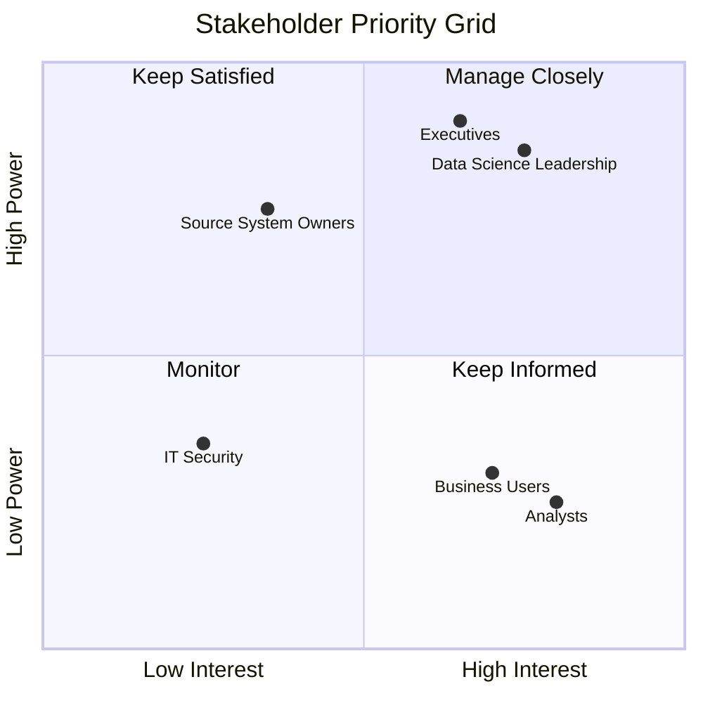

<details>
<summary><strong>📖 Lecture 20 Details — Stakeholder Management</strong></summary>

### Key Stakeholder Groups

| Stakeholder          | What They Need              | Communication Style            |
| -------------------- | --------------------------- | ------------------------------ |
| Data Scientists / ML | Clean, accessible data      | Technical, collaborative       |
| Data Analysts / BI   | Structured data for reports | SQL-focused, business context  |
| Executives           | High-level metrics          | Business outcomes, KPIs        |
| Software / Platform  | APIs, SLAs                  | Technical specs                |
| Business Users       | Self-service insights       | Non-technical, outcome-focused |
| Source System Owners | Integration coordination    | Schema changes, API access     |

### Requirements Gathering (4 Steps)

```
STEP 1: CLARIFY BUSINESS GOALS
├── What problem are we solving?
├── What decisions will this enable?
└── What's the expected ROI?

STEP 2: UNDERSTAND DATA NEEDS
├── What data sources are needed?
├── What freshness is required?
└── What transformations are needed?

STEP 3: DEFINE ACCEPTANCE CRITERIA
├── What does "done" look like?
├── How will success be measured?
└── What are the SLAs?

STEP 4: DOCUMENT & GET SIGN-OFF
├── Scope (in vs. out)
├── Trade-offs and assumptions
└── Stakeholder approval
```

### Communication by Audience

| Audience        | Focus On                        | Avoid                  |
| --------------- | ------------------------------- | ---------------------- |
| Executives      | Business impact, ROI, timelines | Technical jargon       |
| Data Scientists | Data availability, APIs         | Over-simplification    |
| Business Users  | Outcomes, ease of use           | Implementation details |
| Engineers       | Tech specs, architecture        | Business fluff         |

### Expectation Management

| ✅ DO                        | ❌ DON'T                        |
| --------------------------- | ------------------------------ |
| Be honest about timelines   | Over-promise and under-deliver |
| Communicate blockers early  | Hide problems until too late   |
| Provide regular updates     | Go silent for weeks            |
| Document scope changes      | Accept scope creep silently    |
| Show progress incrementally | Wait until "perfect" to share  |

### Managing Conflicts

| Situation               | Approach                                        |
| ----------------------- | ----------------------------------------------- |
| Different priorities    | Use data to quantify impact; escalate if needed |
| Unrealistic timelines   | Present scope vs. time vs. quality tradeoffs    |
| Changing requirements   | Implement change control process                |
| Technical debt pressure | Balance short-term vs. long-term in sprints     |

</details>

---

## 🧠 Master Cheat Sheet

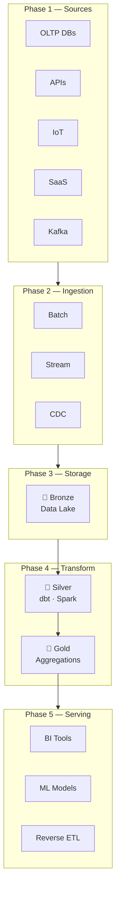

### 🔑 Key Formulas to Remember

| Concept   | Formula / Pattern                                  |
| --------- | -------------------------------------------------- |
| Medallion | Bronze → Silver → Gold                             |
| Ingestion | Batch (cheap) · Stream (fast) · CDC (changes only) |
| Storage   | Warehouse (SQL) · Lake (raw) · Lakehouse (both)    |
| Transform | Raw → Clean → Business-ready                       |
| Serving   | BI · ML · Reverse ETL                              |
| Ops       | Develop → Test → Deploy → Monitor → 🔁              |

---

*📚 Source: Enterprise Data Engineering Masterclass — Section 2 | v3.0 Jan 2026*V