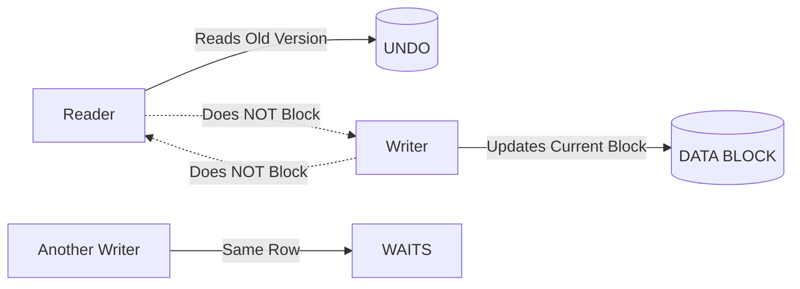
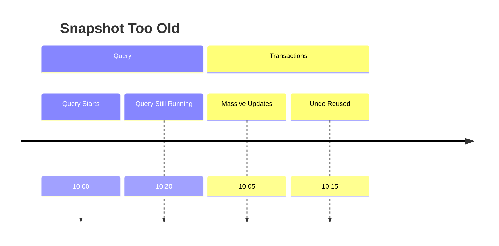
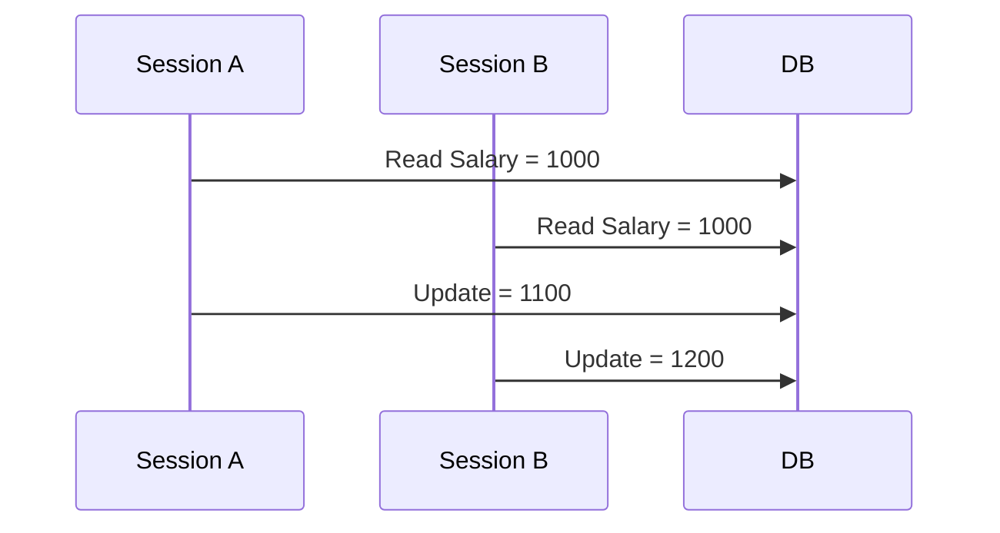
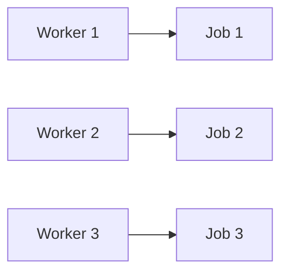
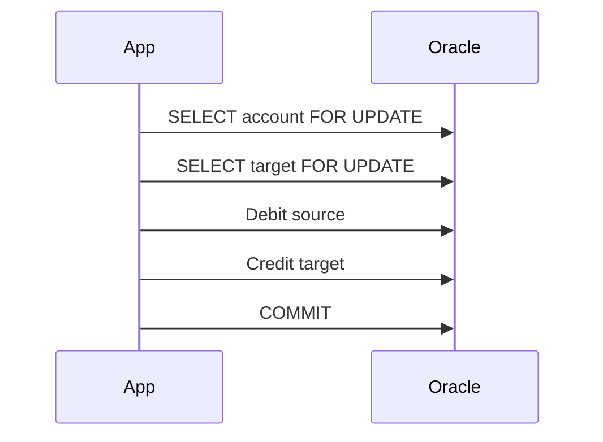
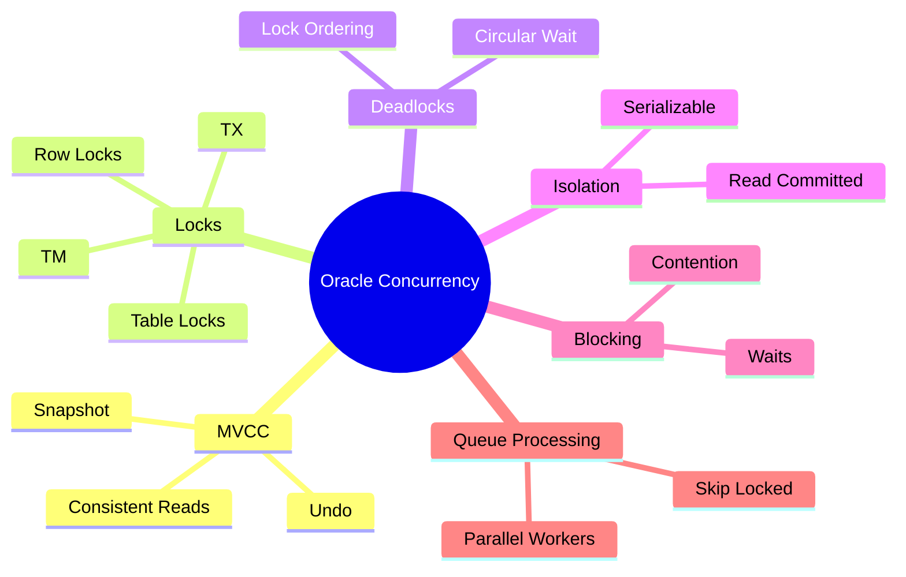

# 🚀 Oracle Concurrency & Locking — Complete Revision Notes

> **Advanced SQL & Oracle Internals | Enterprise Revision Guide**
> Focus: MVCC · Locks · Deadlocks · Isolation Levels · Blocking · Real-World Concurrency

---

# 📌 At a Glance

| Topic             | Purpose                        | Key Concept                   |
| ----------------- | ------------------------------ | ----------------------------- |
| MVCC              | Consistent reads               | Readers don’t block writers   |
| Row Locks         | Protect rows during updates    | TX locks                      |
| Table Locks       | Protect table structure/access | TM locks                      |
| Deadlocks         | Circular waiting               | Oracle kills one transaction  |
| Isolation Levels  | Transaction visibility         | READ COMMITTED / SERIALIZABLE |
| SELECT FOR UPDATE | Manual row locking             | Pessimistic locking           |
| SKIP LOCKED       | Parallel processing            | Queue systems                 |
| Blocking Sessions | Waiting transactions           | Lock contention               |

---

# 🧠 Core Philosophy of Oracle Concurrency



---

# 🔥 Oracle's Golden Rules

| Rule                            | Meaning                        |
| ------------------------------- | ------------------------------ |
| Readers never block writers     | SELECT won’t stop UPDATE       |
| Writers never block readers     | UPDATE won’t stop SELECT       |
| Writers block writers           | Same row update causes waiting |
| Locks stay till COMMIT/ROLLBACK | No auto release                |
| Oracle uses MVCC                | Old versions stored in UNDO    |

---

# 🏗️ Multi-Version Concurrency Control (MVCC)

## 📖 What is MVCC?

Oracle creates **multiple versions of data** using **UNDO segments**.

When a transaction changes data:

* New value → data block
* Old value → undo segment

Readers use old values if needed.

---

## ⚡ Example

### Session A

```sql
SELECT balance FROM accounts;
```

Balance = 1000

---

### Session B

```sql
UPDATE accounts
SET balance = 5000
WHERE account_id = 1;

COMMIT;
```

---

### Session A STILL sees:

```sql
1000
```

Because Oracle reconstructs old data from UNDO.

---

# 🧩 Why MVCC Matters

| Benefit             | Explanation                     |
| ------------------- | ------------------------------- |
| High concurrency    | Readers & writers work together |
| Faster applications | Less waiting                    |
| Consistent reads    | Query sees stable snapshot      |
| Better scalability  | Thousands of users possible     |

---

# ⚠️ Edge Case — ORA-01555 Snapshot Too Old

One of Oracle’s most famous errors.

```text
ORA-01555: snapshot too old
```

## Why It Happens

* Long-running query
* Undo data overwritten
* Oracle cannot reconstruct old version anymore

---

## Example Scenario



Query needs old data from 10:00, but undo already reused.

---

## Prevention

| Method                          | Why                   |
| ------------------------------- | --------------------- |
| Increase UNDO tablespace        | More history retained |
| Tune long queries               | Finish faster         |
| Commit less frequently in loops | Reduce undo churn     |
| Proper indexing                 | Avoid huge scans      |

---

# 🔒 Locks in Oracle

---

# 📌 Types of Locks

| Lock Type           | Protects               | Example          |
| ------------------- | ---------------------- | ---------------- |
| Row Lock (TX)       | Specific rows          | UPDATE employees |
| Table Lock (TM)     | Table structure/access | ALTER TABLE      |
| Latches             | Internal memory        | Buffer cache     |
| Library Cache Locks | SQL execution plans    | Parsing          |

---

# 🔥 Row-Level Locks (TX)

Most common lock.

```sql
UPDATE employees
SET salary = 90000
WHERE employee_id = 100;
```

Oracle locks ONLY that row.

---

## Another Session

### Different Row

```sql
UPDATE employees
SET salary = 95000
WHERE employee_id = 101;
```

✅ Works immediately

---

### Same Row

```sql
UPDATE employees
SET salary = 92000
WHERE employee_id = 100;
```

⏳ WAITS

---

# 🧠 Important Oracle Advantage

Unlike some databases:

✅ Oracle does NOT escalate row locks into table locks automatically.

This is VERY important for scalability.

---

# 🏛️ Table Locks (TM)

Used automatically during:

* DML
* DDL
* Constraints
* Structural changes

---

# 📊 Table Lock Modes

| Mode | Name          | Allows         | Blocks          |
| ---- | ------------- | -------------- | --------------- |
| RS   | Row Share     | Concurrent DML | Exclusive       |
| RX   | Row Exclusive | Normal DML     | Share/Exclusive |
| S    | Share         | Reads          | Updates         |
| X    | Exclusive     | Nothing        | Everything      |

---

# ⚡ Explicit Locking

```sql
LOCK TABLE employees
IN EXCLUSIVE MODE;
```

Nobody else can modify table.

---

# ⚠️ Restriction

Explicit table locking is dangerous in production.

Why?


---

# 🧨 Deadlocks

---

# 📖 What is Deadlock?

Two sessions wait for each other forever.


---

# ⚡ Deadlock Example

---

## Session 1

```sql
UPDATE accounts
SET balance = balance - 100
WHERE account_id = 1;
```

---

## Session 2

```sql
UPDATE accounts
SET balance = balance - 100
WHERE account_id = 2;
```

---

## Session 1

```sql
UPDATE accounts
SET balance = balance + 100
WHERE account_id = 2;
```

WAITING...

---

## Session 2

```sql
UPDATE accounts
SET balance = balance + 100
WHERE account_id = 1;
```

💥 DEADLOCK

---

# 🚨 Oracle Behavior

Oracle automatically:

* detects deadlock
* kills ONE transaction
* raises:

```text
ORA-00060: deadlock detected
```

---

# ✅ Best Prevention Strategy

## Consistent Lock Ordering

Always lock resources in same order.

```sql
-- Always smaller ID first
IF acc1 < acc2 THEN
   lock acc1;
   lock acc2;
ELSE
   lock acc2;
   lock acc1;
END IF;
```

---

# ⚠️ Hidden Enterprise Deadlock Causes

| Cause                          | Common In      |
| ------------------------------ | -------------- |
| Different update order         | Banking apps   |
| Triggers updating other tables | ERP systems    |
| Foreign key without index      | OLTP systems   |
| Batch jobs + online users      | E-commerce     |
| Cascading updates              | Legacy schemas |

---

# 🚨 Massive Interview Trap

## Unindexed Foreign Keys

This surprises many developers.

---

## Parent Update/Delete

```sql
DELETE FROM departments
WHERE department_id = 10;
```

Oracle must check child table.

Without FK index:

* full table scan
* heavy locking
* contention

---

# ✅ Fix

```sql
CREATE INDEX emp_dept_fk_idx
ON employees(department_id);
```

---

# 🔐 SELECT FOR UPDATE

Used for:

* pessimistic locking
* preventing lost updates

---

# 📌 Basic Syntax

```sql
SELECT *
FROM employees
WHERE employee_id = 100
FOR UPDATE;
```

Locks selected rows.

---

# 🧠 Why Use It?

Without it:



Lost update problem.

---

# ✅ With FOR UPDATE

Only one session modifies row at a time.

---

# ⚡ NOWAIT

```sql
SELECT *
FROM employees
WHERE employee_id = 100
FOR UPDATE NOWAIT;
```

If locked:

```text
ORA-00054 resource busy
```

No waiting.

---

# ⚡ WAIT n

```sql
FOR UPDATE WAIT 5;
```

Waits maximum 5 seconds.

---

# 🚀 SKIP LOCKED

One of Oracle’s BEST concurrency features.

---

# 📦 Queue Processing Pattern

```sql
SELECT *
FROM job_queue
WHERE status = 'PENDING'
FOR UPDATE SKIP LOCKED;
```

---

# 🧠 Why It's Amazing

Multiple workers process jobs simultaneously:



No collisions.

---

# ✅ Used In

| System          | Usage                  |
| --------------- | ---------------------- |
| Payment systems | Transaction queues     |
| Email services  | Background jobs        |
| Kafka consumers | Parallel workers       |
| ETL pipelines   | Distributed processing |

---

# ⚠️ SKIP LOCKED Restriction

Can cause:

* starvation
* skipped rows forever
* unfair processing

Needs retry mechanism.

---

# 🧪 Isolation Levels

---

# 📌 READ COMMITTED (Default)

Each query sees latest committed data.

---

## Example

```sql
SELECT balance FROM accounts;
```

Returns:

```text
1000
```

Another session commits update.

Second SELECT:

```text
1500
```

---

# ⚠️ Non-Repeatable Read Possible

Same query → different result.

---

# 🔒 SERIALIZABLE

Transaction sees snapshot from transaction start.

```sql
SET TRANSACTION ISOLATION LEVEL SERIALIZABLE;
```

---

# ⚡ Behavior

Even if others commit changes:

* your transaction sees old snapshot

---

# ⚠️ Restriction

Can cause:

```text
ORA-08177: can't serialize access
```

---

# 🧠 Why?

Oracle prevents conflicting concurrent writes.

---

# 📊 Isolation Comparison

| Feature              | READ COMMITTED | SERIALIZABLE |
| -------------------- | -------------- | ------------ |
| Default              | ✅ Yes          | ❌ No         |
| Performance          | Faster         | Slower       |
| Consistency          | Medium         | High         |
| Non-repeatable reads | Possible       | Prevented    |
| Serialization errors | No             | Yes          |

---

# 🚧 Blocking Sessions

---

# 📖 What is Blocking?

One session waits for another’s lock.

---

# 🔍 Find Blocking Sessions

```sql
SELECT
    s1.sid blocked_sid,
    s2.sid blocker_sid
FROM v$session s1
JOIN v$session s2
ON s1.blocking_session = s2.sid;
```

---

# ⚠️ Production Symptoms

| Symptom              | Root Cause        |
| -------------------- | ----------------- |
| Application hangs    | Long transactions |
| Timeout errors       | Blocked sessions  |
| Slow screens         | Row contention    |
| CPU low but app slow | Lock waits        |

---

# 🧠 Hidden Production Problem

## Idle Transaction

Developer forgets COMMIT.

```sql
UPDATE employees
SET salary = 90000
WHERE employee_id = 100;
```

Goes to lunch ☕

Entire app waits.

---

# ✅ Best Practices

| Practice                                  | Why                 |
| ----------------------------------------- | ------------------- |
| Commit quickly                            | Release locks       |
| Keep transactions short                   | Reduce contention   |
| Index foreign keys                        | Prevent table locks |
| Use SKIP LOCKED for queues                | Parallelism         |
| Avoid user interaction during transaction | Long waits          |
| Lock in consistent order                  | Prevent deadlocks   |

---

# 🚫 Anti-Patterns

| Anti-Pattern             | Problem              |
| ------------------------ | -------------------- |
| Long transactions        | Huge blocking        |
| COMMIT inside loops      | Undo fragmentation   |
| Massive batch updates    | Lock storms          |
| Missing indexes          | Full scans + locking |
| Serializable everywhere  | Scalability issues   |
| SELECT then UPDATE later | Race conditions      |

---

# 🧠 Real-World Banking Transfer Flow



This ensures:

* no double spending
* consistency
* atomicity

---

# 🔥 Most Important Interview Concepts

| Concept              | Very Important? |
| -------------------- | --------------- |
| MVCC                 | ⭐⭐⭐⭐⭐           |
| Deadlocks            | ⭐⭐⭐⭐⭐           |
| SELECT FOR UPDATE    | ⭐⭐⭐⭐⭐           |
| SKIP LOCKED          | ⭐⭐⭐⭐            |
| ORA-01555            | ⭐⭐⭐⭐⭐           |
| Isolation Levels     | ⭐⭐⭐⭐⭐           |
| Foreign Key Indexing | ⭐⭐⭐⭐            |

---

# 🎯 Final Mental Model



---

# 🏁 Final Takeaways

✅ Oracle concurrency is built around MVCC
✅ Readers & writers usually don’t block each other
✅ Writers block only conflicting writers
✅ Deadlocks happen because of inconsistent lock order
✅ SKIP LOCKED is extremely useful for distributed workers
✅ Long transactions are one of the biggest production problems
✅ Proper indexing dramatically affects locking behavior
✅ Concurrency problems are often application design problems, not just database problems

